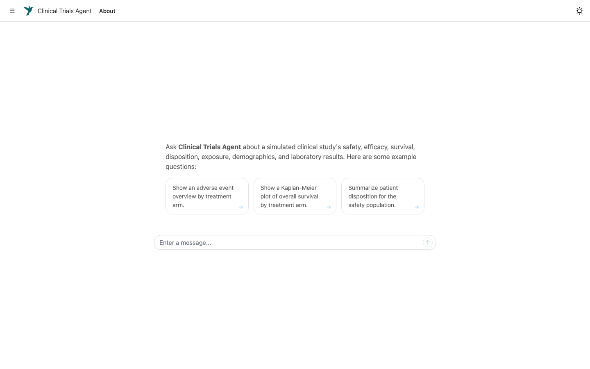

# Clinical Trials Agent

Clinical Trials Agent is an example
[commons](https://github.com/posit-dev/commons) self-service data agent for
clinical trials. It answers questions about a simulated clinical study's
safety, efficacy time-to-event endpoints, disposition, exposure, demographics,
and laboratory results.

The agent first tries to answer questions with measures: trusted calculations
that reproduce or adapt recipes from the
[NEST TLG Catalog](https://github.com/insightsengineering/tlg-catalog). For
questions outside measure coverage, it can run governed SQL over the study's
CDISC ADaM datasets.

**[Try it out](https://connect.posit.cloud/posit/content/01a04163-015f-f8f9-6f2a-af6d9a33e572)**



**Note:** This app uses synthetic sample data and is intended for demonstration only. It contains no real patient data.

## Run locally

Dependencies are declared in `DESCRIPTION`. Install the latest compatible
versions, including the pinned development versions of `commons` and
`shinychat`, with
[`remotes`](https://remotes.r-lib.org/). You also need an
[Anthropic API key](https://console.anthropic.com/settings/keys) for the model
configured in `agent.R`.

```r
install.packages("remotes")
remotes::install_deps(dependencies = TRUE, upgrade = "always")
```

`remotes` is used temporarily because
[`pak` 0.11.1 cannot install some current macOS CRAN binaries](https://github.com/r-lib/pak/issues/915).
Once that issue is fixed, this can return to
`pak::local_install_dev_deps(upgrade = TRUE)`.

Set an Anthropic API key in your `.Renviron` (or edit [this line](https://github.com/posit-dev/clinical-trials-agent/blob/8b6e50617d96c2fb9ab0639354b3c3e1c06e8997/agent.R#L9) locally to use a different provider) and start the Shiny app.

```
# Add your API key to your .Renviron
ANTHROPIC_API_KEY="your-key"
```

Then, restart your R session before running:

```r
shiny::runApp()
```

The main application is in `app.R`. `agent.R` configures the model and commons
layers; `measures/` contains the trusted calculations; `context/`,
`instructions.md`, and `dictionaries/adam.data-dict.yaml` govern interpretation
of the data.

## Coverage

Standard questions are answered by measures; anything a measure doesn't cover
falls back to governed SQL over the ADaM datasets.

The semantic layer currently contains 26 measures: 15 tables, 4 listings, and
7 graphs. Coverage is intentionally selective and uses the parts of the
synthetic data that behave realistically.

**Adverse events - the full table and listing family** (the agent's safety focus):

| Catalog | Measure |
|---|---|
| AET01 | `ae_overview` |
| AET02 | `ae_by_soc_pt` |
| AET03 | `ae_by_intensity` |
| AET04 | `ae_by_grade` |
| AET04_PI | `ae_frequent_by_grade` |
| AET05 | `ae_incidence_rate` |
| AET06 | `ae_by_sex` |
| AET09 | `ae_related` |
| AET10 | `ae_most_frequent` |
| AEL01 | `ae_term_listing` |
| AEL02 | `ae_detail_listing` |
| AEL03 | `serious_ae_listing` |
| AEL04 | `patient_death_listing` |

**Other domains - representative core outputs:**

| Catalog | Measure |
|---|---|
| DMT01 | `demography` |
| DST01 | `disposition` |
| EXT01 | `exposure_summary` |
| DTHT01 | `deaths` |
| LBT04 | `lab_abnormalities` |

**Efficacy time-to-event:**

| Catalog | Measure |
|---|---|
| TTET01 | `survival_summary` |
| KMG01 | `survival_km_plot` |

**Graphs and survival curves - rendered directly by measures:**

| Catalog | Measure |
|---|---|
| BRG01 | `ae_by_soc_plot` |
| BWG01 | `exposure_by_arm_plot` |
| BWG01 | `age_by_arm_plot` |
| BWG01 | `lab_by_arm_plot` |
| MNG01 | `lab_over_time_plot` |
| Kaplan-Meier | `ae_event_free_plot` |

## Data

The agent exposes six synthetic analysis datasets from
[`random.cdisc.data`](https://insightsengineering.github.io/random.cdisc.data/):

| Dataset | Contents |
|---|---|
| `adsl` | Subject-level demographics, treatment, disposition, and analysis populations |
| `adae` | Adverse events |
| `adex` | Study drug exposure |
| `adlb` | Laboratory results |
| `adaette` | Adverse-event time-to-event and event-count parameters |
| `adtte` | Efficacy time-to-event endpoints, including OS, PFS, and EFS |

## Attribution

The measures in `measures/` reproduce or adapt recipes from the
[insightsengineering/tlg-catalog](https://github.com/insightsengineering/tlg-catalog),
which is copyright 2023 F. Hoffmann-La Roche AG and licensed under the
[Apache License, Version 2.0](https://www.apache.org/licenses/LICENSE-2.0).
Each measure's `@provenance` tag pins the exact catalog source file and commit
it was extracted from. See [`NOTICE`](NOTICE) for the full attribution.

Code original to this repository is licensed under the [MIT License](LICENSE).
